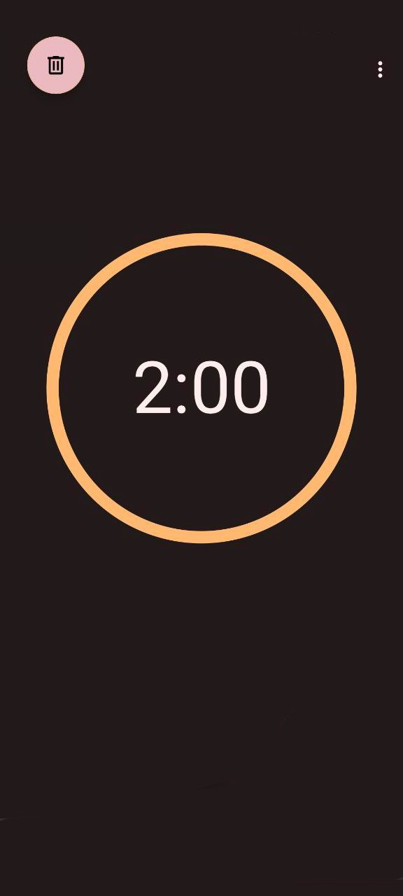

### TrainingTimer 

### Ru 
Таймер для тренировки по принципу подходов, с поддержкой гарнитуры. 
Больше не нужно взаимодействовать с телефоном для контроля времени отдыха.
Запускайте таймер после подхода нажатием кнопки на гарнитуре, по истечению времени получите звуковое оповещение.

### En
Set timer with headset support.
You no longer need to interact with your phone to control rest time. 
Start the timer after the approach by pressing the button on the headset, after the time has elapsed, receive a sound notification.
